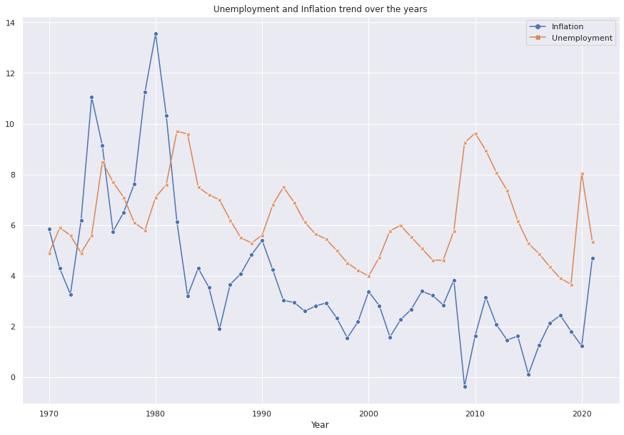
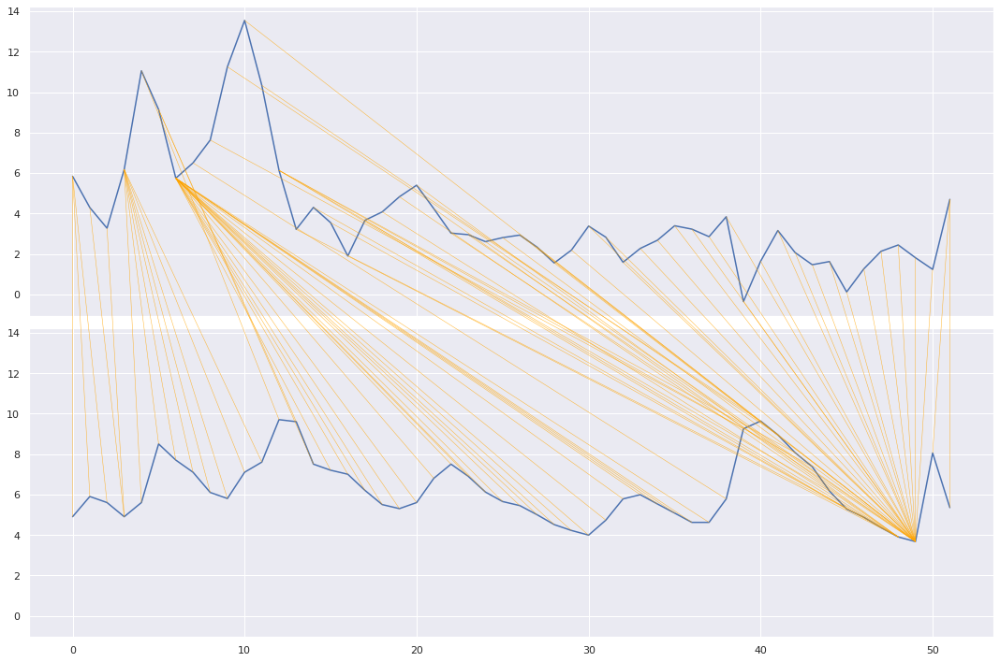
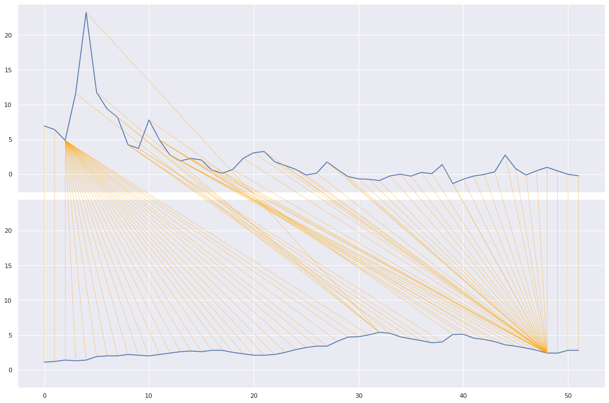
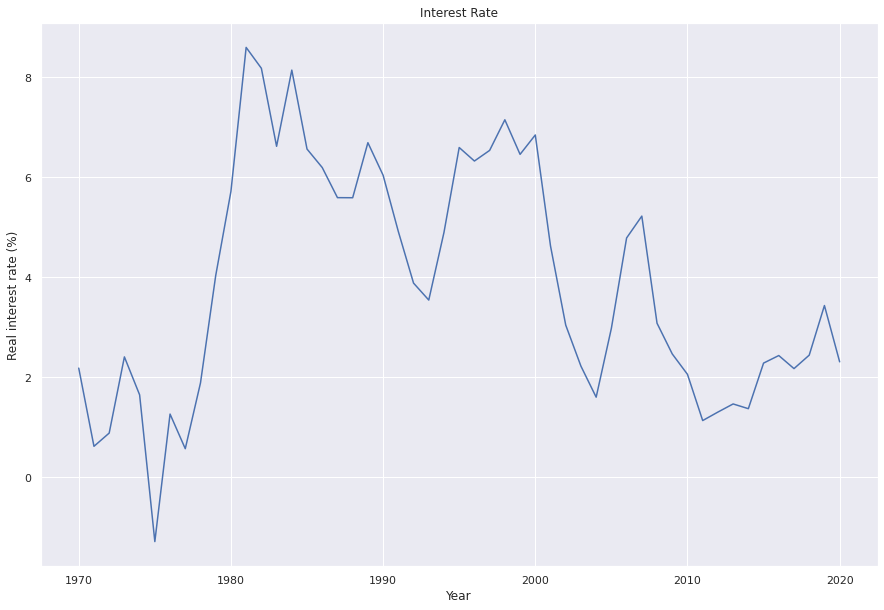
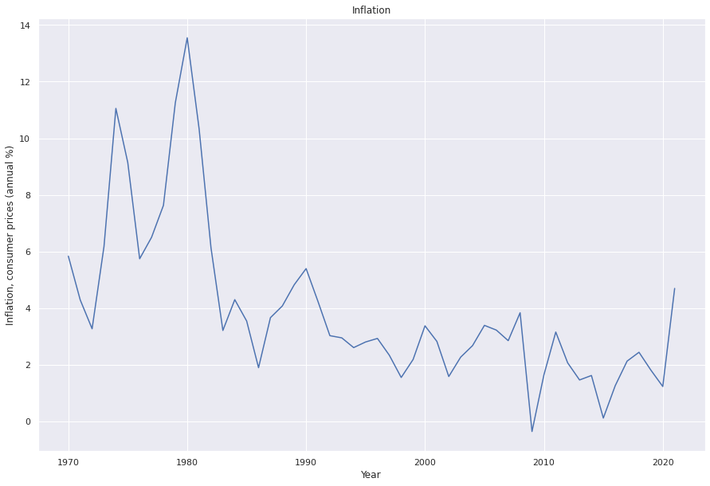
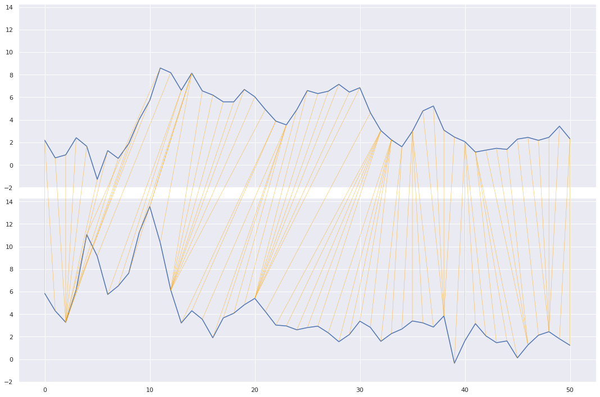

# Inflation, Interest Rate, and Unemployment: A Real-World Economic Data Analysis

## Context & Objective

This notebook investigates whether conventional economic theories regarding the relationships between inflation, unemployment, and interest rates hold true when examined with real-world data. The author, a student of business and economics, expresses skepticism about textbook theories and aims to test these relationships using historical data.

## Data & Setup

The analysis utilizes a dataset containing annual economic indicators for various countries from 1970 onwards. Key variables include:
*   `Inflation, consumer prices (annual %)`
*   `Inflation, GDP deflator (annual %)`
*   `Real interest rate (%)`
*   `Deposit interest rate (%)`
*   `Lending interest rate (%)`
*   `Unemployment, total (% of total labor force) (national estimate)`
*   `Unemployment, total (% of total labor force) (modeled ILO estimate)`

The dataset also includes `country`, `year`, `iso3c`, `iso2c`, `adminregion`, and `incomeLevel`. The initial exploration focuses on the United States.

## Key Analytic Steps & Insights

*   **US Inflation and Unemployment Trends:** Visual inspection of time series plots for the United States suggested a potential relationship between inflation and unemployment, though not immediately clear.
*   **Pearson's Correlation (US Inflation vs. Unemployment):** A Pearson's correlation coefficient of approximately `0.000` was calculated, indicating no significant linear relationship between inflation and unemployment in the United States data. This contradicts the inverse relationship often taught in economic theory (e.g., Phillips Curve).
*   **Dynamic Time Warping (DTW) for US Inflation vs. Unemployment:** To account for potential time delays, Dynamic Time Warping (DTW) was applied. The visual warping paths and a DTW distance of `102.7` suggest that a straightforward, delayed relationship is not strongly supported by the data.
*   **DTW for Japan Inflation vs. Unemployment:** Extending the analysis to Japan (the only other country with complete data for these variables), the DTW distance was significantly larger (`209.6`), further indicating a lack of a clear, consistent time-series relationship. Japan's unique economic history of persistent low inflation was noted as a contributing factor.
*   **US Interest Rate and Inflation Trends:** Visualizing the trends for real interest rates and consumer price inflation in the United States showed a noticeable co-movement, particularly during the 1970s-1980s period, aligning with the theory that higher inflation calls for higher interest rates.
*   **Dynamic Time Warping (DTW) for US Interest Rate vs. Inflation:** Despite the visual alignment in certain periods, the DTW distance for US real interest rate and inflation was `100.8`, which was not significantly different from the inflation-unemployment comparison. This suggests that while theory holds in specific historical contexts (like the Volcker era), the overall mathematical relationship across the entire period is complex due to various economic events.

## Figures & Visual Story

**Figure 1 — Unemployment and Inflation Trend over the Years (United States)**
This line plot shows the annual consumer price inflation and national unemployment rates for the United States. While some periods show inverse movement, the overall relationship is not immediately clear from a simple visual inspection.

**Figure 2 — Dynamic Time Warping: US Inflation vs. Unemployment**
This plot illustrates the Dynamic Time Warping alignment between US inflation and unemployment. The warping path (diagonal lines) indicates how points in one series align with points in the other. A DTW distance of `102.7` was calculated, suggesting a complex, rather than straightforward, relationship.

**Figure 3 — Dynamic Time Warping: Japan Inflation vs. Unemployment**
Similar to the US analysis, this plot shows the DTW alignment for Japan's inflation and unemployment. The significantly larger DTW distance of `209.6` and the visual complexity of the warping path indicate an even weaker relationship compared to the United States.

**Figure 4 — Real Interest Rate Trend over the Years (United States)**
This line plot displays the real interest rate trend in the United States. A notable spike is observed around the 1970s-1980s, a period known for significant monetary policy actions.

**Figure 5 — Inflation Trend over the Years (United States)**
This plot shows the consumer price inflation trend for the United States. It mirrors the interest rate trend in Figure 4, particularly the spike in the 1970s-1980s, suggesting a relationship during that specific historical context.

**Figure 6 — Dynamic Time Warping: US Real Interest Rate vs. Inflation**
This DTW plot compares the US real interest rate and inflation. While visually there are periods of alignment, the calculated DTW distance of `100.8` is comparable to the inflation-unemployment analysis, suggesting that a simple, consistent mathematical relationship is challenged by various economic events over time.

## Conclusions & Next Steps

The analysis suggests that while economic theories provide a foundational understanding, real-world data often presents more complex relationships than textbook models imply.
*   For the United States, neither a simple Pearson's correlation nor Dynamic Time Warping strongly supported a straightforward, consistent relationship between inflation and unemployment.
*   Similarly, while US interest rates and inflation showed co-movement in specific historical periods (e.g., the 1970s-1980s), the overall mathematical relationship across the entire dataset was not as clear-cut as theory might suggest.
*   The case of Japan further highlighted how unique national economic contexts can deviate significantly from generalized theories.

The author emphasizes that economic theory is merely the "tip of the iceberg" and encourages a deeper understanding of historical events, news, and the "why" behind economic changes, rather than relying solely on theoretical "hard and fast rules." Experience and a true understanding of economic fundamentals are deemed most important.